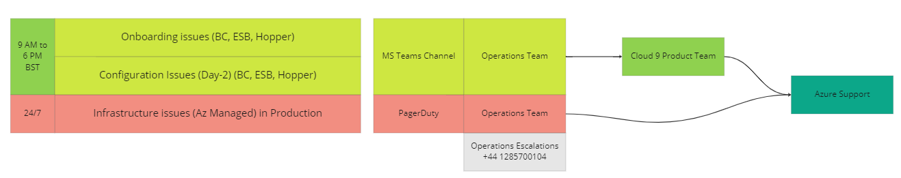

# Contact Us
## How can we help you?

Cloud 9 Product isn't working the way you expect, are you Struck and need assestence to Cloud 9 Products ?

Get help and support related to Cloud 9 Products Muziris, Eco System Builder, Brightcloud, DevOps Hopper  raise a Post in <a href="https://teams.microsoft.com/l/team/19%3adnlQpvbo7zsPTGQVuXaRYH1UjDRPnOCJC7XI7064u6w1%40thread.tacv2/conversations?groupId=9db482de-c01a-4efb-9c4f-6693ad31c189&tenantId=bd5c6713-7399-4b31-be79-78f2d078e543" target="_blank">Cloud 9 Support Teams</a> Channel

For Posts raised during business hours one can except to get a response almost instently and for any Azure Cloud Infrastructure Issues support is avilable 24/7 

++++++++++++++++++++++++++++++++++++++++

<h1 style=" text-align: left; box-sizing: border-box;">Contact Us</h3>
<h2 style=" text-align: left; box-sizing: border-box;margin: 0rem;">
  How can we help you?</h2>
 
<h4 style=" text-align: left; box-sizing: border-box;">Are you Struck and need assestence to Cloud 9 Products ?
 

  
</h4>  
